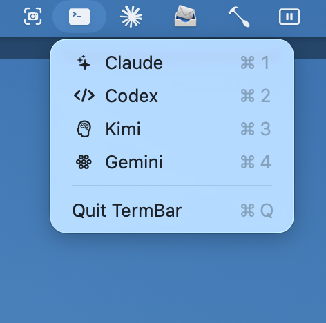
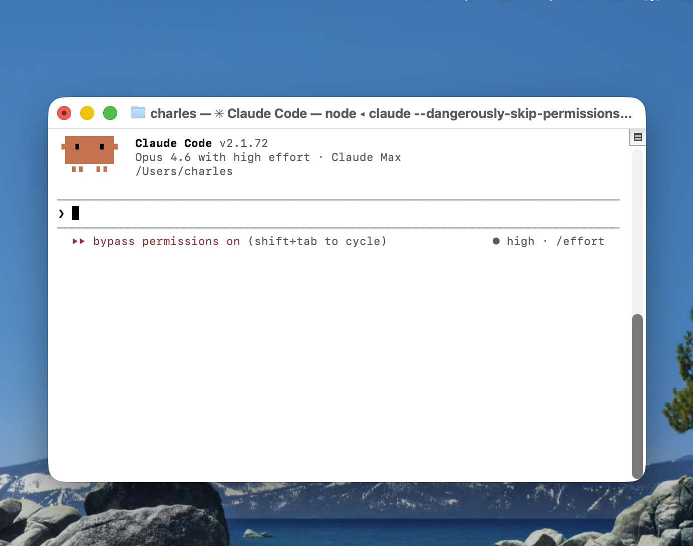

# TermBar

**One-click access to AI coding agents from your macOS menu bar.**

TermBar is a lightweight macOS menu bar app that gives you instant access to your AI CLI tools. Click the terminal icon, pick your agent, and a fresh Terminal window opens ready to go.



## Features

- **Four AI agents** in one dropdown: Claude, Codex, Kimi, and Gemini
- **Keyboard shortcuts** (Cmd+1 through Cmd+4) for instant launch
- **Global hotkey** (Ctrl+Opt+T) opens the menu from any app
- **Fresh Terminal window** every time — no reusing stale sessions
- **Native macOS** menu bar app — no Electron, no overhead
- **SF Symbols** for each tool so you can identify them at a glance

## How It Works

1. Click the terminal icon in your menu bar (or press **Ctrl+Opt+T**)
2. Select an AI agent from the dropdown
3. A new Terminal window opens with the CLI tool running



*Claude Code launched via TermBar with permissions bypass enabled.*

## Supported Tools

| Agent | Command | Shortcut | Description |
|-------|---------|----------|-------------|
| Claude | `claude --dangerously-skip-permissions` | Cmd+1 | Anthropic's Claude Code CLI with auto-permissions |
| Codex | `codex` | Cmd+2 | OpenAI's Codex CLI agent |
| Kimi | `kimi-cli` | Cmd+3 | Moonshot AI's Kimi CLI agent |
| Gemini | `gemini` | Cmd+4 | Google's Gemini CLI agent |

## Installation

### Prerequisites

Install the CLI tools you want to use:

```bash
# Claude Code
npm install -g @anthropic-ai/claude-code

# Codex
npm install -g @openai/codex

# Kimi CLI
# See https://github.com/anthropics/kimi-cli

# Gemini CLI
npm install -g @anthropic-ai/gemini
```

### Build from Source

Requires **Swift 6** and **macOS 13+**.

```bash
git clone https://github.com/CharlescSturt/term-bar.git
cd term-bar
bash Scripts/build_app.sh
```

This builds a release binary and installs it to `~/Applications/TermBar.app`.

### Launch

```bash
open ~/Applications/TermBar.app
```

To start TermBar automatically at login, add it to **System Settings > General > Login Items**.

## Configuration

TermBar is configured in `Sources/TermBar/AppDelegate.swift`. To add or modify tools, edit the `tools` array:

```swift
private let tools: [ToolItem] = [
    ToolItem(name: "Claude", symbolName: "sparkles", command: "claude --dangerously-skip-permissions", keyEquivalent: "1"),
    ToolItem(name: "Codex", symbolName: "chevron.left.forwardslash.chevron.right", command: "codex", keyEquivalent: "2"),
    // Add more tools here
]
```

Then rebuild:

```bash
bash Scripts/build_app.sh
```

## Technical Details

- **Swift 6** with strict concurrency
- **Swift Package Manager** (no Xcode project required)
- **Carbon API** for global hotkey registration
- **NSStatusItem** for native menu bar integration
- **LSUIElement** — runs as a menu bar agent (no Dock icon)
- Launches tools via `.command` files opened by `NSWorkspace` — no AppleScript or Accessibility permissions needed

## Why TermBar?

If you work with multiple AI coding agents throughout the day, switching between them means opening Terminal, typing the command, waiting for it to load. TermBar removes that friction — the agent you need is always two clicks (or one hotkey) away.

## License

MIT
